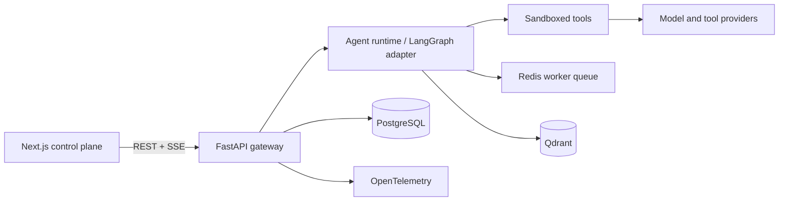
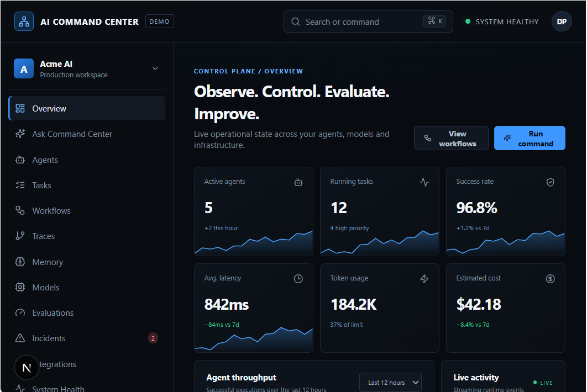
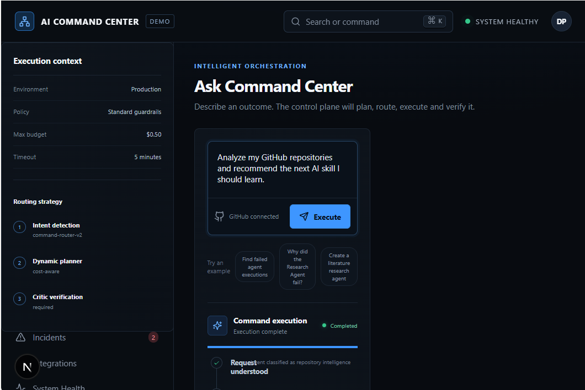
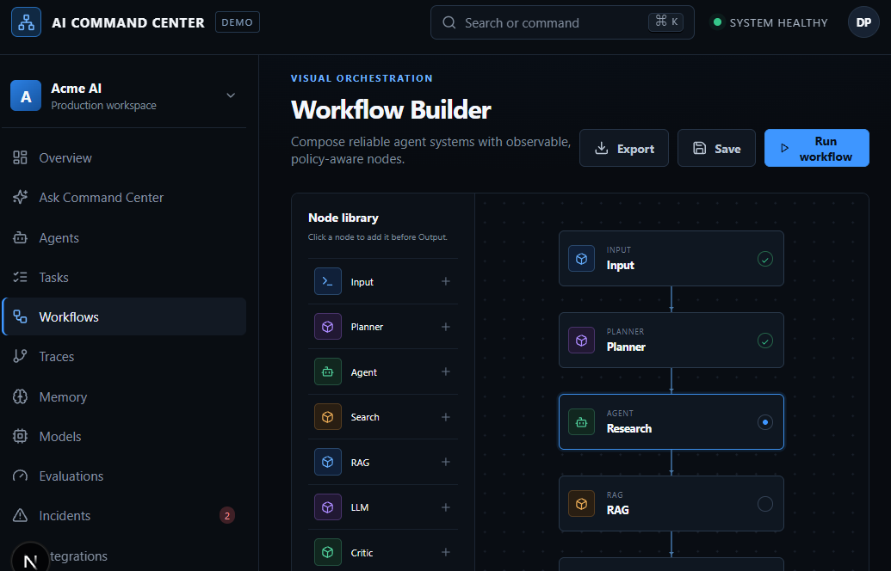
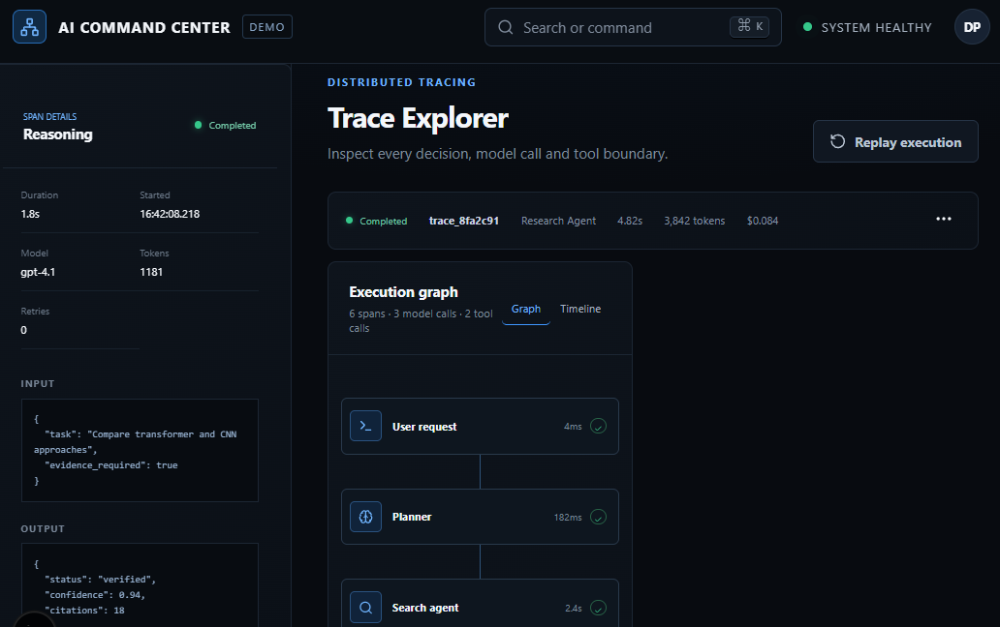
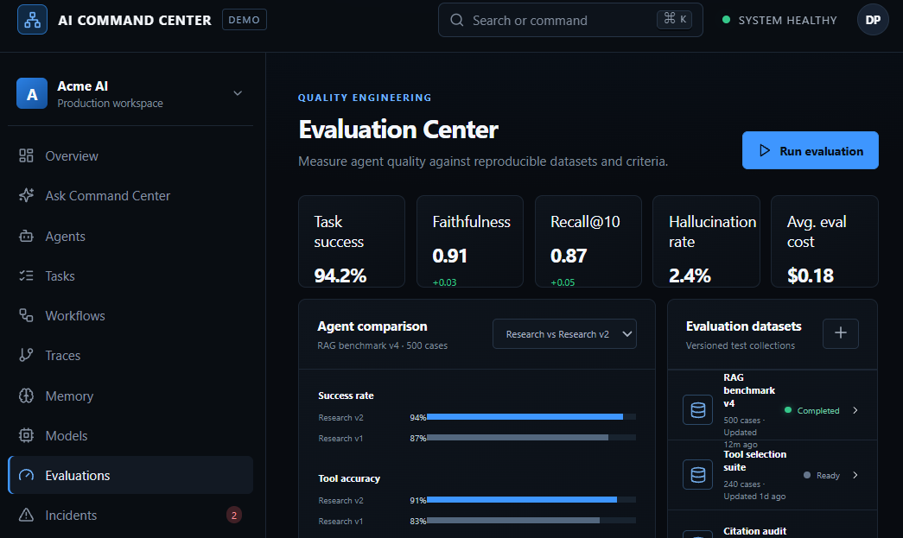

# AI COMMAND CENTER

> **One interface. Every agent. Total control.**  
> Observe. Control. Evaluate. Improve.

AI Command Center is a local-first control plane for creating, executing, observing and evaluating AI agents. It combines a premium operational UI with a FastAPI event runtime, persistent run history, visual workflow tooling, trace replay, model telemetry, memory governance, evaluation, incident diagnosis, approvals and integrations.

The repository is immediately runnable in **Demo Mode** without paid APIs. Demo actions are deterministic and visibly labeled; they still use real API requests, SQLite persistence and Server-Sent Events—not cosmetic loading timers. Provider adapters can be enabled with environment variables.

## Why this exists

AI systems are distributed systems. Prompts, model calls, retrieval, tools, approval gates and retries are usually scattered across provider consoles and logs. AI Command Center puts those operational boundaries into one inspectable control plane.

## Architecture



Local zero-config mode uses SQLite in place of PostgreSQL and an in-process deterministic execution adapter in place of external providers. The HTTP and event contracts are unchanged.

## Features

- Fleet overview with live operational metrics and runtime activity
- Agent create, configure and enable/disable lifecycle
- **Ask Command Center** with streamed intent, planning, agent, tool, reasoning and critic stages
- Server-Sent Event execution stream persisted as run events
- Clickable trace graph, span inspector and execution replay controls
- Visual workflow canvas with add, configure, duplicate, delete, save, run and export actions
- Memory graph, semantic search, inline editing and deletion
- System health and model-level telemetry
- Incident center with diagnostic workflow
- Evaluation datasets and side-by-side agent quality comparisons
- Integration inventory with secret-safe status management
- Responsive UI, command palette (`⌘/Ctrl + K`), visible focus states and reduced-motion support
- SQLite/PostgreSQL-oriented schema with foreign keys, indexes, status and audit tables

## Tech stack

| Layer | Technology |
|---|---|
| UI | Next.js 16, React 19, TypeScript, CSS design system, Lucide |
| API | Python, FastAPI, Pydantic, async SSE |
| Persistence | SQLite locally; PostgreSQL production contract |
| Queue/cache | Redis |
| Vector store | Qdrant |
| Orchestration | Event-oriented runtime; LangGraph provider boundary |
| Observability | OpenTelemetry adapter boundary |
| Runtime | Docker Compose |

## Quick start

Requirements: Node 20+, npm 10+, Python 3.11+.

```bash
git clone <repository-url>
cd ai-command-center
cp .env.example .env

# Terminal 1 — API
python -m venv .venv
source .venv/bin/activate
pip install -r backend/requirements.txt
uvicorn backend.main:app --reload --host 0.0.0.0 --port 8000

# Terminal 2 — UI
cd frontend
npm install
npm run dev
```

Open [http://localhost:3000](http://localhost:3000). API docs are available at [http://localhost:8000/docs](http://localhost:8000/docs).

### Run the built-in demo

1. Open **Ask Command Center**.
2. Keep the provided request: “Analyze my GitHub repositories and recommend the next AI skill I should learn.”
3. Select **Execute**.
4. Watch the persisted SSE stages complete and inspect the MLOps recommendation.

If the API is offline, the UI explicitly falls back to its deterministic browser demo so the interface remains reviewable.

## Docker setup

```bash
cp .env.example .env
docker compose up --build
```

Compose provisions the frontend, backend, PostgreSQL, Redis and Qdrant. The checked-in backend defaults to SQLite for the zero-config runtime; set `DATABASE_URL` and enable the production database adapter when deploying.

## Environment variables

| Variable | Purpose |
|---|---|
| `DEMO_MODE` | Deterministic local provider (`true` by default) |
| `DATABASE_URL` | PostgreSQL async connection URI |
| `REDIS_URL` | Queue/cache URI |
| `QDRANT_URL` | Vector database endpoint |
| `OPENAI_API_KEY` | OpenAI adapter credential |
| `ANTHROPIC_API_KEY` | Anthropic adapter credential |
| `GEMINI_API_KEY` | Google model adapter credential |
| `GITHUB_TOKEN` | Read-scoped repository analysis |
| `SECRET_ENCRYPTION_KEY` | Envelope encryption key for integration secrets |
| `JWT_SECRET` | Authentication signing secret |

Never commit `.env`. API keys are not returned by API contracts and must never enter model context.

## Agent architecture

Every execution follows a durable event contract:

```text
Request → Intent → Plan → Agent selection → Tool call → Reasoning → Critic → Result
```

`POST /api/runs` creates a persistent run. `GET /api/runs/{id}/events` streams named SSE events while atomically writing ordered `agent_events`. `GET /api/runs/{id}` reconstructs the run for trace and replay interfaces. The deterministic provider uses the same boundary expected from a LangGraph graph, which keeps local development stable and integration replacement straightforward.

## Workflow example

```text
Input → Planner → GitHub Agent → Technology Extraction
      → Skill Graph → Gap Detection → Research Agent → Critic → Output
```

Workflow definitions are versioned JSON graphs composed of `workflow_nodes` and `workflow_edges`. Sensitive nodes should route through a Human Approval node before execution.

## Evaluation methodology

Evaluation records separate datasets from runs. Suggested production metrics:

- **Agent:** task success, latency, cost, tool-selection accuracy
- **Retrieval:** Recall@5, Recall@10, MRR
- **Generation:** faithfulness, relevance, citation correctness, hallucination rate
- **Operations:** timeout rate, retries, approval frequency and incident correlation

Pin dataset versions, evaluator models and prompts. Store raw judgments alongside aggregates so scores remain auditable.

## API summary

| Method | Route | Function |
|---|---|---|
| `GET` | `/api/health` | runtime mode and liveness |
| `GET` | `/api/dashboard` | persisted operational summary |
| `GET/POST` | `/api/agents` | list/create agents |
| `PATCH` | `/api/agents/{id}/toggle` | enable/disable agent |
| `DELETE` | `/api/agents/{id}` | remove agent |
| `POST` | `/api/runs` | create execution |
| `GET` | `/api/runs/{id}` | run and ordered trace events |
| `GET` | `/api/runs/{id}/events` | SSE execution stream |
| `GET/POST` | `/api/memories` | search/create memory |
| `DELETE` | `/api/memories/{id}` | delete memory |
| `GET` | `/api/services` | service health |

## Database

`backend/database/schema.sql` includes users, agents, tools, runs, events, tasks, workflow graphs, memories, entities, models, model calls, evaluations, incidents, approvals, integrations, audit logs and service health. Foreign-key enforcement and execution indexes are enabled in local mode.

## Security considerations

- Demo mode is intended for local evaluation, not internet exposure.
- Production deployments must put the API behind OIDC/JWT authentication and role-based authorization.
- Encrypt provider secrets with a KMS-backed envelope key and return status only.
- Apply per-user and per-workspace rate limits at the gateway and Redis layers.
- Never pass secrets into prompts, traces or logs.
- Treat all tool inputs as untrusted and validate them with typed allowlists.
- **Never execute model-produced commands on the host.** Code tools must run as an unprivileged user in an ephemeral container with a read-only filesystem, CPU/memory/time limits, disabled network by default and an explicit mounted workspace.
- Require approval records for writes, external side effects and privilege escalation.
- Export append-only audit logs to a separate retention boundary.

The local runtime does not expose arbitrary command execution.

## Testing

```bash
pytest -q
cd frontend && npm run build
```

Recommended production additions include Playwright navigation/form tests, SSE disconnect/reconnect tests, Postgres migration tests, authorization matrix tests, provider contract tests and container escape regression tests.

## Screenshots

### Operational Overview

<p align="center">
  
</p>

Monitor agent activity, running tasks, success rates, latency, token usage, estimated cost, and system health.

---

### Intelligent Orchestration

<p align="center">
  
</p>

Submit a high-level objective and observe the execution pipeline from intent detection through planning, agents, tools, reasoning, and verification.

---

### Visual Workflow Builder

<p align="center">
  
</p>

Create and execute observable agent workflows using configurable nodes.

---

### Trace Explorer

<p align="center">
  
</p>

Inspect execution graphs, model calls, tool calls, inputs, outputs, duration, tokens, retries, and replayable execution history.

---

### Evaluation Center

<p align="center">
  
</p>

Evaluate agents against reproducible datasets using task success, faithfulness, retrieval quality, hallucination rate, and evaluation cost.

## Demo video

Record a 90-second walkthrough: command palette → demo execution → trace inspection → workflow modification → incident diagnosis.

## Roadmap

- OIDC organizations and fine-grained RBAC
- Durable Redis worker execution and cancellation
- Production PostgreSQL repository and Alembic migrations
- LangGraph checkpoint adapter
- OpenTelemetry trace export and trace-to-run correlation
- Isolated Firecracker/gVisor code sandbox service
- Versioned workflow collaboration and environment promotion
- Evaluator calibration and human labeling queues

## Contributing

1. Create a focused branch.
2. Keep local demo mode deterministic and runnable.
3. Add tests for behavior changes.
4. Run API tests and the production frontend build.
5. Document new provider configuration without committing credentials.

## License


